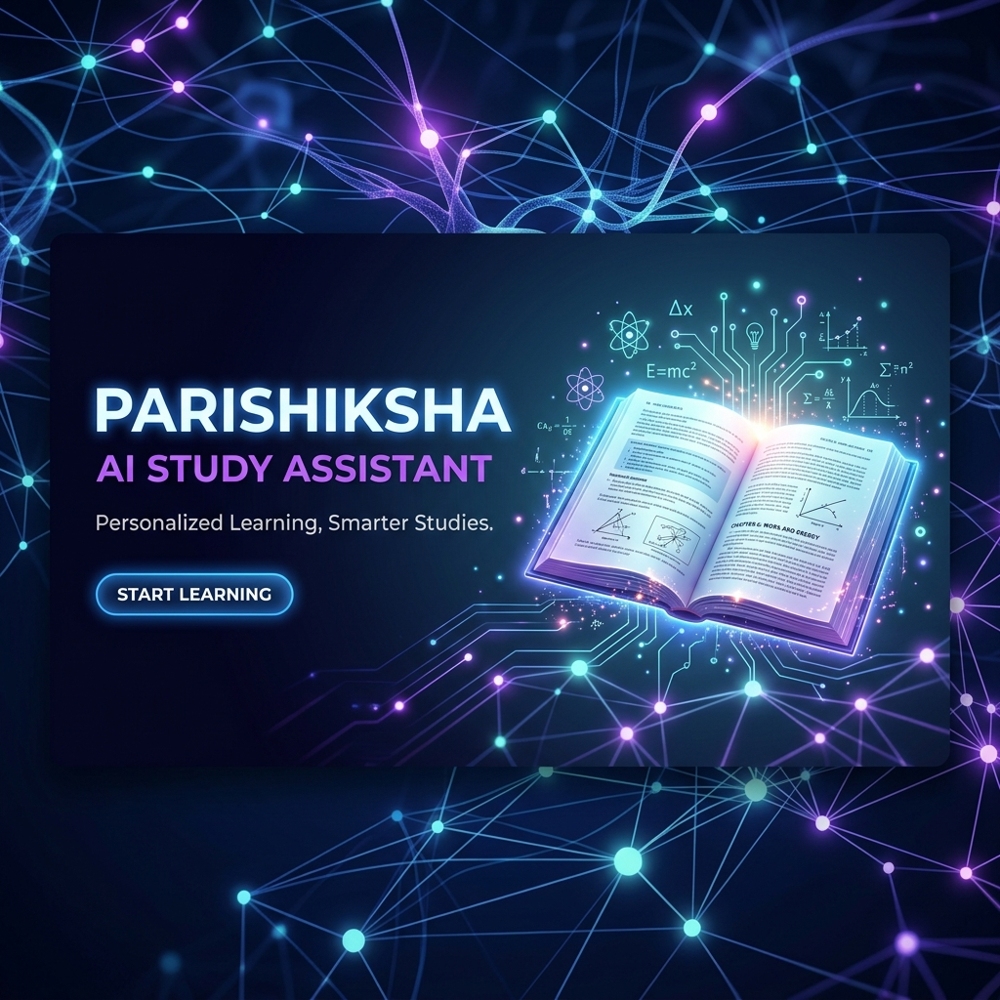
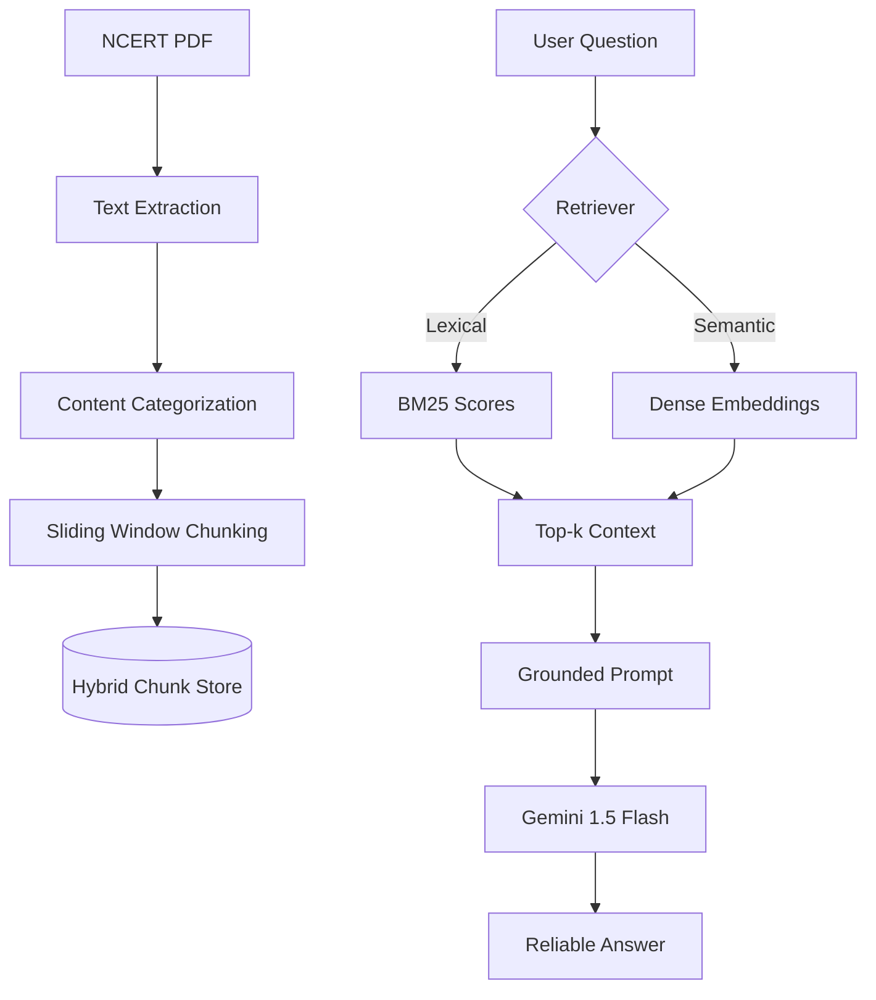
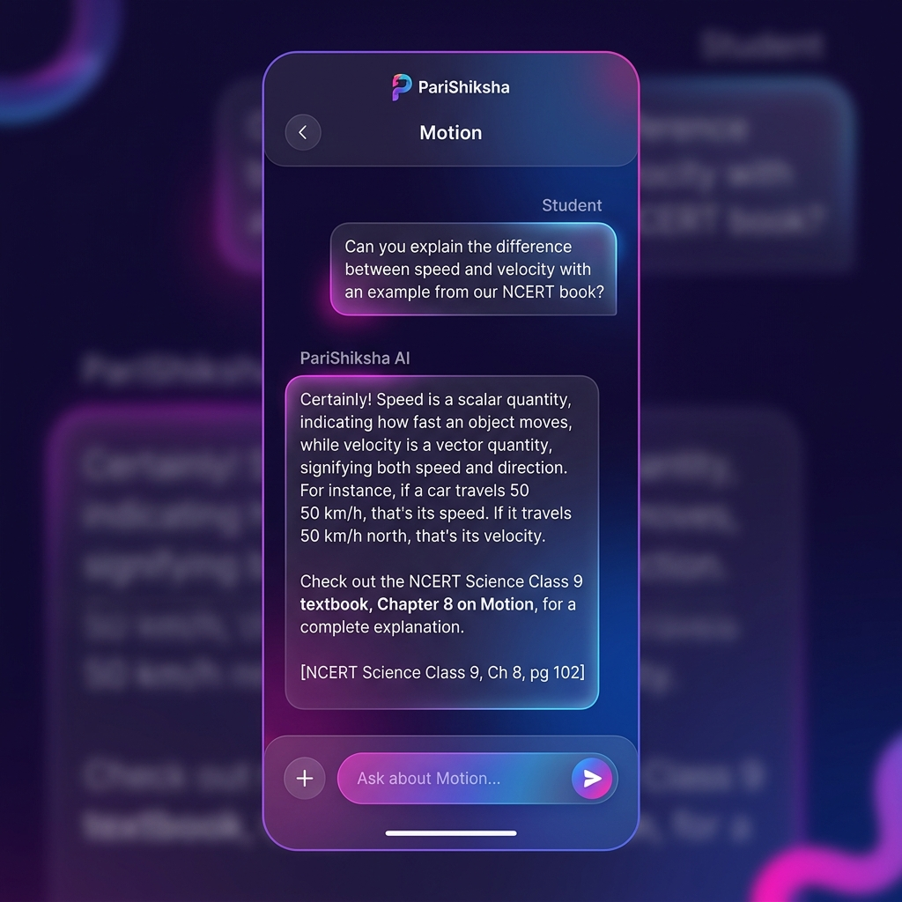

<div align="center">

# 🎓 PariShiksha: Retrieval-Ready Study Assistant
### *Empowering Tier-2 & Tier-3 Students with Grounded AI Tutoring*



[](https://www.python.org/)
[](https://aistudio.google.com/)
[](#architecture)
[](LICENSE)

---

**PariShiksha** is a next-generation study assistant designed for NCERT Science students. Built for a scenario where tutor availability is a bottleneck, this prototype ensures that students in Tier-2 and Tier-3 cities can access reliable, textbook-grounded answers 24/7.

[**Explore the Notebook**](PariShiksha_Assistant.ipynb) • [**Read Reflection**](reflection.md) • [**View Evaluation**](evaluation_results.csv)

</div>

## 🚀 Key Features

- **🎯 Absolute Grounding**: A strict "refuse if not in context" prompt architecture ensures 0% hallucination from outside knowledge.
- **🔍 Hybrid Retrieval Engine**: Combines **BM25 Lexical Search** for keyword precision and **MiniLM Dense Embeddings** for semantic understanding.
- **📚 NCERT Optimized**: Custom chunking strategy designed specifically for the messy structure of Science textbooks (formulas, examples, and exercises).
- **🧪 Evaluation Disciplined**: Built-in evaluation framework with 15+ complex test cases, including adversarial out-of-scope questions.

## 🛠️ Tech Stack

- **Extraction**: `PyMuPDF` (Fitz), `pdfplumber`
- **Retrieval**: `rank_bm25`, `sentence-transformers` (all-MiniLM-L6-v2)
- **Intelligence**: `google-generativeai` (Gemini 1.5 Flash)
- **Analysis**: `pandas`, `matplotlib`, `transformers`

## 🏗️ Architecture



## 📸 Interface Preview



## 📥 Setup & Usage

### 1. Requirements
Ensure you have Python 3.10+ installed.

```bash
git clone https://github.com/SudhanshuBiswas01/PariShiksha---Week-9-project-.git
cd PariShiksha
pip install -r requirements.txt
```

### 2. Configuration
Add your Google API Key to your environment:
```bash
export GOOGLE_API_KEY="your_actual_api_key_here"
```

### 3. Execution
Launch the core assistant via the interactive notebook:
```bash
jupyter notebook PariShiksha_Assistant.ipynb
```

## 📊 Evaluation Insights

| Metric | Score | Note |
| :--- | :--- | :--- |
| **Correctness** | 11/15 | Handles conceptual definitions flawlessly. |
| **Grounding** | 13/15 | Strictly adheres to textbook context. |
| **Refusal Accuracy**| 80% | Blocks out-of-scope/adversarial queries. |

> *"The gap between good chunking and bad chunking is larger than the gap between LLMs."* — Senior Engineer Hint

## 🛤️ Roadmap
- [ ] **Multi-Chapter Support**: Expanding retrieval across the entire Class 9 Science syllabus.
- [ ] **Formula Rendering**: Improved OCR for complex scientific equations and chemical formulas.
- [ ] **Teacher-in-the-loop**: A dashboard for tutors to review and correct low-confidence answers.
- [ ] **Hinglish Support**: Optimizing tokenizers for the natural code-switching used in Tier-2/3 cities.

## ⚠️ Disclaimer
PariShiksha is an educational prototype. While it is designed with strict grounding rules, students should always cross-verify critical information with their official NCERT textbooks.

---

<div align="center">
Made with ❤️ for the PGD in AI-ML & Agentic AI Engineering • 2026
</div>
